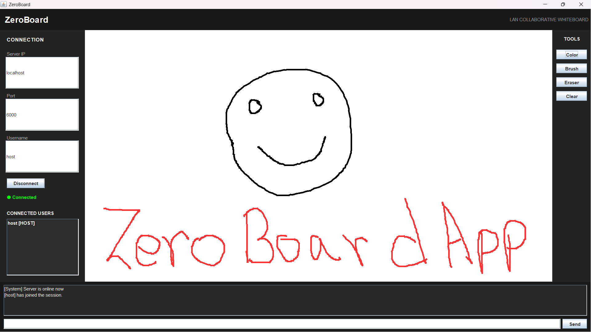
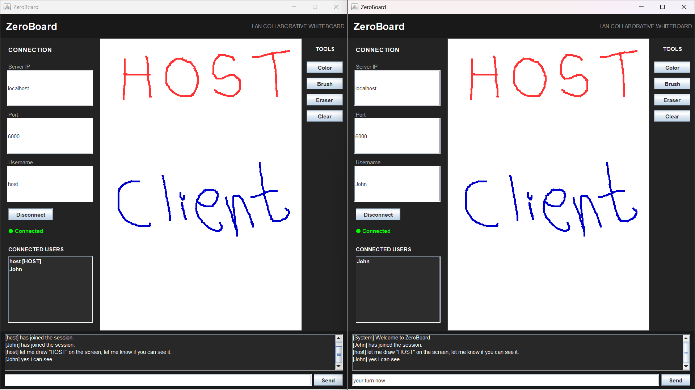
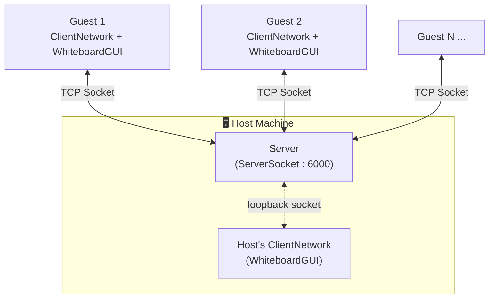

<div align="center">

# 🧩 ZeroBoard

### A Real‑Time Collaborative LAN Whiteboard, built in pure Java

*Draw together. Chat together. No internet required.*


</div>

---

## 📖 Overview

**ZeroBoard** is a lightweight, LAN-based collaborative whiteboard application written entirely in core Java — no external frameworks, no internet dependency. One user **hosts** a session (spinning up both the server and their own whiteboard window), and any number of other users can **join as guests** over the same network to draw and chat together in real time.

It's built as a hands-on demonstration of **client–server architecture using raw TCP sockets**, **multithreading with Java virtual threads**, and a **custom lightweight text protocol** — all wrapped in a clean, dark-themed Swing GUI.

---


## 🖼️ Screenshots

### Main Interface



### Real-Time Collaborative Drawing



---
## ✨ Features

| Status | Feature | Description                                                                                                                  |
|:---:|---|------------------------------------------------------------------------------------------------------------------------------|
| ✅ | **Real-time collaborative drawing** | Every stroke drawn by one user is instantly broadcast and rendered on every connected peer's canvas.                         |
| ✅ | **Live group chat** | Multi-directional, concurrent chat between the host and every connected guest, tagged with usernames.                        |
| ✅ | **Host / Guest roles** | One instance runs as `HOST` (owns the server + joins as a client itself); others run as `GUEST` and connect to the host's IP. |
| ✅ | **Custom brush controls** | Pick any color via a color chooser, and set brush thickness (1–50 px).                                                       |
| ✅ | **Eraser tool** | One-click white brush for quick corrections.                                                                                 |
| ✅ | **Connected users panel** | Sidebar list showing who's currently in the session.(Currently works properly for host only.)                                |
| ✅ | **System notifications** | In-chat system messages for connect/disconnect events.                                                                       |
| ✅ | **Lightweight custom protocol** | A simple pipe-delimited (`                                                                                                   |`) text protocol for `DRAW`, `CHAT`, and `USER_JOINED` events — easy to read on the wire, easy to debug. |
| ✅ | **Virtual-thread concurrency** | Each client connection is handled on its own lightweight Java 21 virtual thread — scales cleanly without heavyweight OS threads. |
| 🚧 | **Networked canvas clear** | Clear button currently clears the *local* canvas only; broadcasting the clear event is planned.                              |
| 🚧 | **Undo / Redo** | UI buttons are in place; the underlying history stack is not yet implemented.                                                |
| 🚧 | **Live connection status indicator** | The "Connected / Disconnected" label exists in the UI and will be wired to real-time connection state.                       |


---

## 🏗️ Architecture

ZeroBoard follows a classic **hub-and-spoke client–server model**, where the host machine plays a dual role: it runs the central `Server` **and** connects to it as an ordinary `Client`, so drawing/chat logic never needs to special-case the host.



- The **`Server`** accepts incoming socket connections and spins up a dedicated **`ClientHandler`** thread (Java virtual thread) per connection.
- Any message received from one client is **broadcast** to every other connected client.
- Every participant — including the host — runs the exact same **`WhiteboardGUI`**, differing only by their assigned **`Role`** (`HOST` or `GUEST`).

---

## 📡 Network Protocol

ZeroBoard uses a minimal, human-readable, pipe-delimited (`|`) text protocol over the TCP stream — no external serialization library needed.

| Event | Format | Example |
|---|---|---|
| **Draw** | `DRAW\|x1\|y1\|x2\|y2\|colorRGB\|brushSize` | `DRAW\|120\|85\|140\|95\|-16777216\|4` |
| **Chat** | `CHAT\|username\|message` | `CHAT\|Mayank\|Hello everyone` |
| **User Joined** | `USER_JOINED\|username` | `USER_JOINED\|Mayank` |

These constants live in [`commons/EventMessage.java`](src/commons/EventMessage.java), so the whole protocol has a single source of truth.

---

## 🗂️ Project Structure

```
zeroboardapplication/
└── src/
    ├── client/
    │   ├── ClientApp.java        # Entry point for a guest instance
    │   └── ClientNetwork.java    # Socket connection, send/receive, listeners
    ├── server/
    │   ├── Server.java           # Accepts connections, broadcasts messages
    │   └── ClientHandler.java    # Per-client thread, reads & relays messages
    ├── host/
    │   └── HostApp.java          # Entry point for the host (server + client)
    ├── gui/
    │   ├── WhiteboardGUI.java    # Main window, wires all panels together
    │   ├── CanvasPanel.java      # Drawing surface + remote line rendering
    │   ├── ChatPanel.java        # Chat box + message input
    │   ├── ConnectionPanel.java  # IP/Port/Username fields, user list
    │   └── ToolsPanel.java       # Color, brush size, eraser, clear, undo/redo
    ├── model/
    │   └── Line.java             # A single drawn stroke (coords, color, size)
    ├── commons/
    │   ├── Role.java             # HOST / GUEST enum
    │   ├── ClientStatus.java     # CONNECTED / NOT_CONNECTED enum
    │   ├── EventMessage.java     # Protocol event-type constants
    │   ├── NetworkListener.java  # Callback interface for incoming data
    │   ├── ChatMessage.java      # System message string constants
    │   └── NetworkConfig.java    # Shared server port
    └── tests/
        ├── ChatMessageTest.java  # Assertion-based test for chat parsing
        └── MessageTest.java      # Assertion-based test for draw-event parsing
        └── LineTest.java         # Assertion-based test for Line model parsing


```

---

## 🚀 Getting Started

### Prerequisites

- **JDK 21+** (the project uses `Thread.startVirtualThread(...)`, a Java 21 feature)
- An IDE such as **IntelliJ IDEA** (project ships with a `.iml` module file), or just the command line

### 🔧 BUILD GUIDE
### 🖥️ For Host

1. locate the `buildHost.bat` file in the root directory of the project.
2. Run `.\buildHost.bat` (Windows) to compile the project.
3. This creates a jar file for the HostApp in your computer.

2. This starts the `Server` on port **6000** (see [`NetworkConfig`](src/commons/NetworkConfig.java)) on a background thread, and opens the whiteboard window, auto-connecting as a client to its own server.
3. Share your local IP address with others on the same network.
### 👤For Client/Guest

1. locate the `buildClient.bat` file in the root directory of the project.
2. Run `.\buildClient.bat` (Windows) to compile the project.
3. This creates a jar file for the ClientApp in your computer.

### ▶︎ RUNNING THE APPLICATION

### Run as Host
1. Run `java -jar ZeroBoardHost.jar` to start the host application.
2. This starts the `Server` on port **6000** (see [`NetworkConfig`](src/commons/NetworkConfig.java)) on a background thread, and opens the whiteboard window, auto-connecting as a client to its own server.
3. Share your local IP address with others on the same network.

### Run as Client

1. Run `java -jar ZeroBoardClient.jar` to start the client application.
2. In the **Connection** panel, enter:
    - **Server IP** — the host's local IP address (or `localhost` for same-machine testing)
    - **Port** — `6000` or as provided by the host
    - **Username** — your display name
3. Click **Connect**.

### ⌨️ Command-line example

```bash
# Compile
.\buildHost.bat
OR
.\buildClient.bat

# Run the host
java -jar ZeroBoardHost.jar

# Run a guest (in another terminal / machine)
java -jar ZeroBoardClient.jar
```

---

## 🛠️ Tech Stack

- **Language:** Java 21
- **GUI:** Java Swing
- **Networking:** `java.net.Socket` / `java.net.ServerSocket` (raw TCP)
- **Concurrency:** Java Virtual Threads (`Thread.startVirtualThread`)
- **Build tooling:** IntelliJ IDEA project (no Maven/Gradle dependency required)

---

## 🗺️ Roadmap

- [ ] Broadcast the **Clear Canvas** action to all connected peers
- [ ] Live-update the **connection status indicator** (green/red) in the sidebar
- [ ] Synchronize the **connected users list** across all peers on join/leave
- [ ] Instead of frame **sharing custom messages** to all clients, implement a **message queue** to ensure ordered delivery
- [ ] Graceful reconnect handling on network drop

---

## 🤝 Contributing

This project was built collaboratively — GUI and networking developed as separate, integrated modules. Contributions, issues, and feature suggestions are welcome via pull requests.

---

<div align="center">

Made with ☕ and Java Sockets — for the hackathon 🚀

</div>
